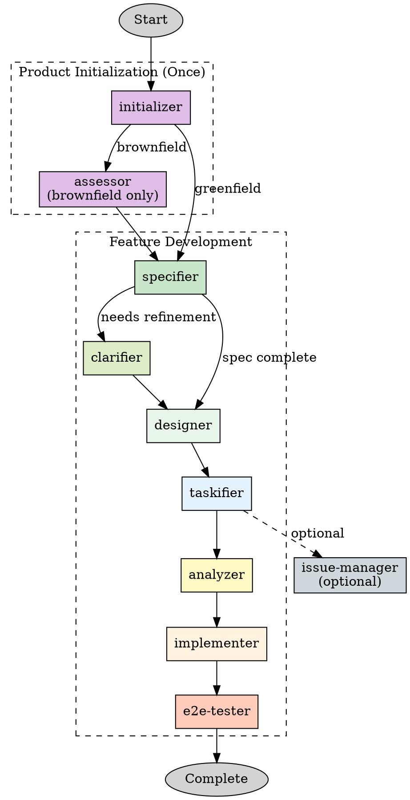

# Using Rainbow

## Overview

Hanoi Rainbow is a Spec-Driven Development (SDD) framework that transforms ideas into production-ready applications through clear specifications. This skill orchestrates a comprehensive agent team with **isolated workspaces** to execute the workflow efficiently and safely.

**Core Principle**: Define **WHAT** and **WHY** before **HOW**.

**Key Architecture**: Each agent works in its own git worktree, preventing conflicts and enabling parallel work. Main agent tracks progress for crash recovery.

## When to Use This Skill

- Starting a new feature with Rainbow workflow
- User mentions `/rainbow.*` commands
- User wants structured development with specification-first approach
- Building features that need design → task breakdown → implementation flow
- User mentions "spec-driven", "design first", or needs team coordination

## Agent Team Configuration

The Rainbow workflow uses a team of specialized agents with isolated workspaces:

| Agent | Commands | When to Use | Workspace Branch |
|-------|----------|-------------|------------------|
| initializer | regulate, architect, standardize, checklist | Product initialization (once per product) | `rainbow/init/<product>` |
| assessor | assess-context | Brownfield projects only | `rainbow/assess/<feature>` |
| specifier | specify | Every new feature | `rainbow/spec/<feature>` |
| clarifier | clarify | When spec needs refinement | `rainbow/clarify/<feature>` |
| designer | design | After spec complete | `rainbow/design/<feature>` |
| taskifier | taskify | After design complete | `rainbow/tasks/<feature>` |
| analyzer | analyze | Before implementation | `rainbow/analyze/<feature>` |
| implementer | implement | After tasks generated | `rainbow/impl/<feature>` |
| e2e-tester | design-e2e-test, perform-e2e-test | After implementation | `rainbow/e2e/<feature>` |
| issue-manager | tasks-to-issues, tasks-to-ado | When tracking needed | `rainbow/issues/<feature>` |

**Full agent configuration JSON**: See [team-patterns.md](references/team-patterns.md) for complete team structure.

## Workflow Phases



**For detailed phase specifications, commands, and outputs**: See [workflow-details.md](references/workflow-details.md).

## Workspace Isolation Architecture

### Git Worktree Strategy

Each agent works in an isolated git worktree to prevent conflicts:

```
main-workspace/                    # Main agent workspace
├── .claude/
│   └── teams/
│       └── rainbow-workflow/
│           ├── config.json        # Team configuration (auto-generated by TeamCreate)
│           ├── team.json          # Agent team configuration with model assignments
│           └── progress.json      # Workflow progress tracking
└── .rainbow/
    └── ...                        # Project files

.claude/worktrees/
├── rainbow-initializer/           # initializer agent worktree
├── rainbow-specifier/             # specifier agent worktree
├── rainbow-designer/              # designer agent worktree
... (one per agent)
```

### Key Tracking Files

| File | Purpose | Created When |
|------|---------|--------------|
| `team.json` | Agent configurations, model assignments, confirmed by user | Before team creation |
| `progress.json` | Workflow phase tracking, current status, outputs | Before workflow starts |
| `config.json` | Auto-generated by TeamCreate, contains agent IDs | After TeamCreate |

### Branch Naming Convention

| Agent | Branch Pattern | Example |
|-------|----------------|---------|
| initializer | `rainbow/init/<product-name>` | `rainbow/init/taskify-app` |
| specifier | `rainbow/spec/<feature-id>` | `rainbow/spec/001-user-auth` |
| designer | `rainbow/design/<feature-id>` | `rainbow/design/001-user-auth` |
| implementer | `rainbow/impl/<feature-id>` | `rainbow/impl/001-user-auth` |

**For complete worktree setup and management**: See [workspace-setup.md](references/workspace-setup.md).

## Progress Tracking for Recovery

### Main Agent Responsibilities

Track workflow progress in `.claude/teams/rainbow-workflow/progress.json`:

```json
{
  "workflow_id": "wf-2024-03-13-001",
  "current_phase": "design",
  "phases": {
    "specify": {
      "status": "completed",
      "agent": "specifier",
      "outputs": ["specs/001-user-auth/spec.md"]
    },
    "design": {
      "status": "in_progress",
      "agent": "designer",
      "outputs": []
    }
  },
  "active_agent": "designer"
}
```

### Recovery Protocol

When resuming after a crash:

1. **Read progress.json** - Find `current_phase` with `in_progress` status
2. **Discard incomplete changes** - Old worktree changes are lost by design
3. **Create fresh worktree** - Pull latest from remote
4. **Spawn agent** - Resume from last completed checkpoint

**For detailed recovery procedures**: See [recovery-guide.md](references/recovery-guide.md).

## Model Selection for Teammates

**MANDATORY**: Before spawning ANY agents, you MUST ask the user to confirm the model for each teammate.

### Workflow Order

```
1. Present recommended models → 2. User confirms/adjusts → 3. Create team.json → 4. Spawn agents → 5. Verify startup
```

**Do NOT skip or reorder these steps.**

### Recommended Models

| Agent | Recommended Model | Reason |
|-------|-------------------|--------|
| initializer | sonnet | Balanced for documentation tasks |
| assessor | sonnet/opus | Code analysis requires understanding |
| specifier | sonnet | Requirement gathering and organization |
| clarifier | sonnet | Interactive Q&A and refinement |
| designer | sonnet/opus | Complex research and decisions |
| taskifier | sonnet | Analysis and organization |
| analyzer | sonnet | Consistency checking |
| implementer | sonnet/opus | Coding and TDD |
| e2e-tester | sonnet | Test design and execution |
| issue-manager | haiku | Simple conversion tasks |

Use AskUserQuestion for model confirmation before creating the team.

## Team Creation Workflow

### Step 1: Confirm Model Selection (MANDATORY)

**CRITICAL**: You MUST ask the user to confirm the model for each teammate BEFORE creating the team.

Use AskUserQuestion to present the recommended model assignments and get user confirmation:

```
AskUserQuestion with:
- header: "Model Selection"
- question: "Please confirm the model for each agent, or specify alternatives:"
- options: Show each agent with recommended model
```

**Do NOT proceed to Step 2 until the user has confirmed or adjusted all model assignments.**

### Step 2: Create Team Configuration Files

Before spawning any agents, create the tracking files:

#### 2a. Create team.json (Agent Team Configuration)

Create `.claude/teams/rainbow-workflow/team.json` with confirmed models:

```json
{
  "team_name": "rainbow-workflow",
  "created_at": "2024-03-13T10:00:00Z",
  "agents": [
    {
      "name": "initializer",
      "model": "sonnet",
      "branch": "rainbow/init/<product>",
      "status": "pending"
    },
    {
      "name": "specifier",
      "model": "sonnet",
      "branch": "rainbow/spec/<feature>",
      "status": "pending"
    },
    {
      "name": "designer",
      "model": "sonnet",
      "branch": "rainbow/design/<feature>",
      "status": "pending"
    }
  ],
  "model_assignments_confirmed": true,
  "confirmed_by_user_at": "2024-03-13T10:05:00Z"
}
```

#### 2b. Create progress.json (Workflow Progress Tracking)

Create `.claude/teams/rainbow-workflow/progress.json` with initial state:

```json
{
  "workflow_id": "wf-2024-03-13-001",
  "current_phase": "init",
  "phases": {
    "init": { "status": "pending", "agent": "initializer", "outputs": [] },
    "specify": { "status": "pending", "agent": "specifier", "outputs": [] },
    "design": { "status": "pending", "agent": "designer", "outputs": [] }
  },
  "active_agent": null
}
```

### Step 3: Create Team and Spawn Agents

```
TeamCreate with team_name: "rainbow-workflow"

For each agent:
  Agent with:
  - name: <agent-name>
  - subagent_type: "general-purpose"
  - team_name: "rainbow-workflow"
  - model: <confirmed-model-from-team.json>
  - isolation: "worktree"
```

### Step 4: Verify Agent Team Startup (CRITICAL)

**MANDATORY**: After spawning agents, verify each agent is running correctly before proceeding.

For each spawned agent:

```
SendMessage to each agent:
- message: "Ping: Please confirm you are ready."
- Wait for response

Check each agent responds with a valid acknowledgment
```

**Verification Checklist**:
- [ ] All agents successfully spawned (check agent IDs returned)
- [ ] Each agent responds to a ping/test message
- [ ] No error messages in agent startup
- [ ] All worktrees created successfully

**If any agent fails to start or respond**:
1. Check error messages
2. Re-spawn the failed agent
3. Re-verify before proceeding

**Do NOT proceed to Step 5 until ALL agents are confirmed running.**

### Step 5: Execute Workflow Phases

1. Send first task to appropriate agent
2. Wait for agent completion message
3. Agent pushes changes to remote
4. Update progress.json
5. Send next task to next agent in sequence

### Step 6: Cleanup on Completion

1. Send shutdown_request to all agents
2. Merge final changes to main branch
3. Remove worktrees
4. TeamDelete

**For detailed agent coordination patterns**: See [team-patterns.md](references/team-patterns.md).

## Key Rules

1. **Confirm models first**: Ask user to confirm model for each agent before creating team
2. **Create team.json before spawning**: Record confirmed model assignments in team.json
3. **Verify agent startup**: Test each agent responds before proceeding with workflow
4. **One agent per workspace**: Each agent has its own git worktree
5. **Sync via remote**: Agents push/pull to share changes
6. **Track progress**: Main agent updates progress.json after each phase
7. **Discard incomplete changes on recovery**: Fresh worktree on restart
8. **Sequential phases**: Most phases depend on previous outputs
9. **Parallel when possible**: issue-manager, e2e-tester can run in parallel

## Red Flags

| Thought | Reality |
|---------|---------|
| "I'll skip the worktree isolation" | Conflicts will occur. Always use worktrees. |
| "I don't need progress tracking" | Cannot recover from crashes. Always track progress. |
| "Agents can share a workspace" | Race conditions and conflicts. Isolate workspaces. |
| "I'll just implement directly" | Skip phases = technical debt. Follow the workflow. |
| "I'll skip model confirmation" | User must approve model assignments. Always ask first. |
| "Agents started, I'll proceed" | Must verify each agent responds. Test before continuing. |
| "I'll create team.json later" | Create team.json BEFORE spawning agents. Order matters. |

## Reference Files

Load reference files based on specific needs:

| File | When to Read |
|------|--------------|
| [workflow-details.md](references/workflow-details.md) | Need complete phase specifications, commands, outputs, or quality gates |
| [workspace-setup.md](references/workspace-setup.md) | Creating or managing git worktrees for agent isolation |
| [team-patterns.md](references/team-patterns.md) | Spawning agents, coordinating handoffs, or handling errors |
| [recovery-guide.md](references/recovery-guide.md) | Recovering from crashes or interruptions |
| [command-reference.md](references/command-reference.md) | Need details about specific Rainbow commands |