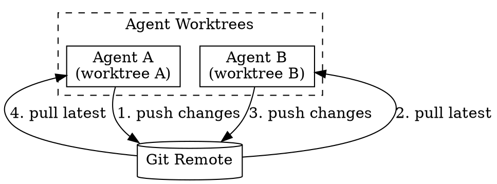
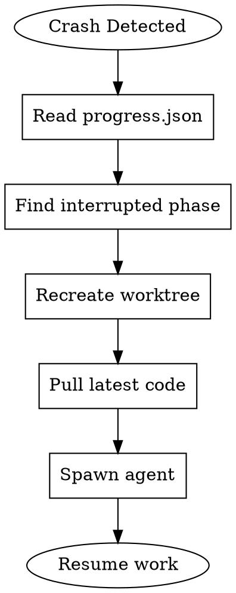
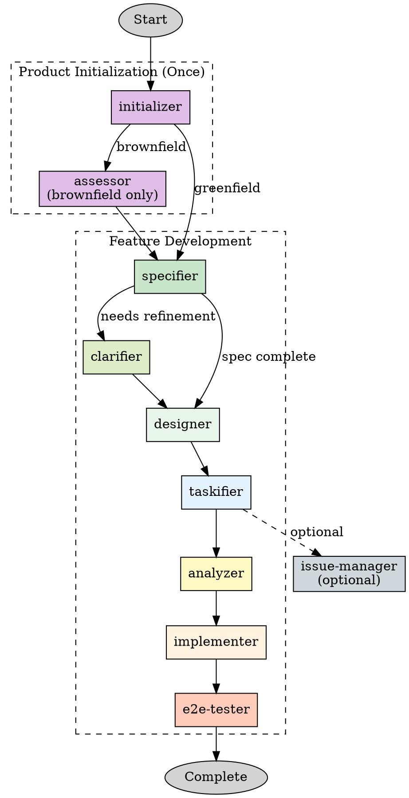

# Using Rainbow

## Overview

Hanoi Rainbow is a Spec-Driven Development (SDD) framework that transforms ideas into production-ready applications through clear specifications. This skill orchestrates a comprehensive agent team with **isolated workspaces** to execute the workflow efficiently and safely.

**Core Principle**: Define **WHAT** and **WHY** before **HOW**.

**Key Architecture**: Each agent works in its own git worktree, preventing conflicts and enabling parallel work. Main agent tracks progress for crash recovery.

## Agent Team Configuration

The Rainbow workflow uses a team of specialized agents with isolated workspaces:

```json
{
  "team_name": "rainbow-workflow",
  "description": "Spec-Driven Development workflow team with isolated workspaces",
  "members": [
    {
      "name": "initializer",
      "agentId": "rainbow-initializer",
      "agentType": "general-purpose",
      "model": "ask user",
      "role": "One-time setup: regulate, architect, standardize, checklist commands",
      "commands": ["/rainbow.regulate", "/rainbow.architect", "/rainbow.standardize", "/rainbow.checklist"]
    },
    {
      "name": "assessor",
      "agentId": "rainbow-assessor",
      "agentType": "general-purpose",
      "model": "ask user",
      "role": "Brownfield analysis: assess-context for existing codebases",
      "commands": ["/rainbow.assess-context"]
    },
    {
      "name": "specifier",
      "agentId": "rainbow-specifier",
      "agentType": "general-purpose",
      "model": "ask user",
      "role": "Feature specification: define requirements and user stories",
      "commands": ["/rainbow.specify"]
    },
    {
      "name": "clarifier",
      "agentId": "rainbow-clarifier",
      "agentType": "general-purpose",
      "model": "ask user",
      "role": "Specification clarification: refine underspecified areas",
      "commands": ["/rainbow.clarify"],
      "notes": "Main agent acts as intermediary for user Q&A"
    },
    {
      "name": "designer",
      "agentId": "rainbow-designer",
      "agentType": "general-purpose",
      "model": "ask user",
      "role": "Technical design: implementation plans with tech stack decisions",
      "commands": ["/rainbow.design"]
    },
    {
      "name": "taskifier",
      "agentId": "rainbow-taskifier",
      "agentType": "general-purpose",
      "model": "ask user",
      "role": "Task breakdown: generate dependency-ordered task lists",
      "commands": ["/rainbow.taskify"]
    },
    {
      "name": "analyzer",
      "agentId": "rainbow-analyzer",
      "agentType": "general-purpose",
      "model": "ask user",
      "role": "Consistency analysis: cross-artifact validation before implementation",
      "commands": ["/rainbow.analyze"]
    },
    {
      "name": "implementer",
      "agentId": "rainbow-implementer",
      "agentType": "general-purpose",
      "model": "ask user",
      "role": "Implementation: execute tasks following TDD principles",
      "commands": ["/rainbow.implement"]
    },
    {
      "name": "e2e-tester",
      "agentId": "rainbow-e2e-tester",
      "agentType": "general-purpose",
      "model": "ask user",
      "role": "E2E testing: design and execute end-to-end tests",
      "commands": ["/rainbow.design-e2e-test", "/rainbow.perform-e2e-test"]
    },
    {
      "name": "issue-manager",
      "agentId": "rainbow-issue-manager",
      "agentType": "general-purpose",
      "model": "ask user",
      "role": "Issue management: convert tasks to GitHub issues or Azure DevOps items",
      "commands": ["/rainbow.tasks-to-issues", "/rainbow.tasks-to-ado"]
    }
  ]
}
```

### Agent Roles Summary

| Agent | Commands | When to Use | Workspace Branch |
|-------|----------|-------------|------------------|
| initializer | regulate, architect, standardize, checklist | Product initialization (once per product) | `rainbow/initializer` |
| assessor | assess-context | Brownfield projects only | `rainbow/assessor` |
| specifier | specify | Every new feature | `rainbow/specifier` |
| clarifier | clarify | When spec needs refinement | `rainbow/clarifier` |
| designer | design | After spec complete | `rainbow/designer` |
| taskifier | taskify | After design complete | `rainbow/taskifier` |
| analyzer | analyze | Before implementation | `rainbow/analyzer` |
| implementer | implement | After tasks generated | `rainbow/implementer` |
| e2e-tester | design-e2e-test, perform-e2e-test | After implementation | `rainbow/e2e-tester` |
| issue-manager | tasks-to-issues, tasks-to-ado | When tracking needed | `rainbow/issue-manager` |

## Workspace Isolation Architecture

### Git Worktree Strategy

Each agent works in an isolated git worktree to prevent conflicts:

```
main-workspace/                    # Main agent workspace
├── .claude/
│   └── teams/
│       └── rainbow-workflow/
│           ├── config.json        # Team configuration
│           └── progress.json      # Workflow progress tracking
└── .rainbow/
    └── ...                        # Project files

.claude/worktrees/
├── rainbow-initializer/           # initializer agent worktree
├── rainbow-assessor/              # assessor agent worktree
├── rainbow-specifier/             # specifier agent worktree
├── rainbow-clarifier/             # clarifier agent worktree
├── rainbow-designer/              # designer agent worktree
├── rainbow-taskifier/             # taskifier agent worktree
├── rainbow-analyzer/              # analyzer agent worktree
├── rainbow-implementer/           # implementer agent worktree
├── rainbow-e2e-tester/            # e2e-tester agent worktree
└── rainbow-issue-manager/         # issue-manager agent worktree
```

### Branch Naming Convention

Each agent's worktree uses a dedicated branch:

| Agent | Branch Name | Purpose |
|-------|-------------|---------|
| initializer | `rainbow/init/<product-name>` | Product setup changes |
| assessor | `rainbow/assess/<feature-id>` | Context assessment |
| specifier | `rainbow/spec/<feature-id>` | Feature specification |
| clarifier | `rainbow/clarify/<feature-id>` | Spec clarifications |
| designer | `rainbow/design/<feature-id>` | Technical design |
| taskifier | `rainbow/tasks/<feature-id>` | Task breakdown |
| analyzer | `rainbow/analyze/<feature-id>` | Analysis reports |
| implementer | `rainbow/impl/<feature-id>` | Implementation |
| e2e-tester | `rainbow/e2e/<feature-id>` | E2E tests |
| issue-manager | `rainbow/issues/<feature-id>` | Issue conversion |

### Workspace Synchronization

Agents synchronize through git remote:



## Progress Tracking for Recovery

### Main Agent Responsibilities

The main agent tracks workflow progress in its workspace for crash recovery:

**File**: `.claude/teams/rainbow-workflow/progress.json`

```json
{
  "workflow_id": "wf-2024-03-13-001",
  "product_name": "taskify-app",
  "feature_id": "001-user-auth",
  "started_at": "2024-03-13T10:00:00Z",
  "current_phase": "design",
  "phases": {
    "initialize": {
      "status": "completed",
      "agent": "initializer",
      "started_at": "2024-03-13T10:00:00Z",
      "completed_at": "2024-03-13T10:30:00Z",
      "outputs": ["memory/ground-rules.md", "docs/architecture.md", "docs/standards.md"]
    },
    "specify": {
      "status": "completed",
      "agent": "specifier",
      "started_at": "2024-03-13T10:30:00Z",
      "completed_at": "2024-03-13T11:00:00Z",
      "outputs": ["specs/001-user-auth/spec.md"]
    },
    "clarify": {
      "status": "completed",
      "agent": "clarifier",
      "started_at": "2024-03-13T11:00:00Z",
      "completed_at": "2024-03-13T11:15:00Z",
      "outputs": ["specs/001-user-auth/spec.md (updated)"]
    },
    "design": {
      "status": "in_progress",
      "agent": "designer",
      "started_at": "2024-03-13T11:15:00Z",
      "outputs": []
    },
    "taskify": {
      "status": "pending"
    },
    "analyze": {
      "status": "pending"
    },
    "implement": {
      "status": "pending"
    },
    "e2e-test": {
      "status": "pending"
    }
  },
  "agents_spawned": ["initializer", "specifier", "clarifier", "designer"],
  "active_agent": "designer"
}
```

### Recovery Protocol

When resuming after a crash:

1. **Read progress.json** from main workspace
2. **Identify interrupted phase** from `current_phase`
3. **Recreate agent workspace**:
   - Create new worktree (old incomplete changes are discarded)
   - Pull latest from remote
   - Spawn agent with phase context
4. **Resume from last completed checkpoint**

**Recovery Flow**:



## Complete Workflow Phases



## Phase Details

### Phase 1: Initialize (initializer agent)

**Trigger**: Product initialization

**Commands**: `/rainbow.regulate`, `/rainbow.architect`, `/rainbow.standardize`, `/rainbow.checklist`

**Actions**:
1. Create project principles (`memory/ground-rules.md`)
2. Create system architecture (`docs/architecture.md`)
3. Create coding standards (`docs/standards.md`)
4. Generate quality checklists

**Output**: Foundation documents for the product

**Branch**: `rainbow/init/<product-name>`

---

### Phase 2: Assess Context (assessor agent) - Brownfield Only

**Trigger**: Existing codebase analysis

**Commands**: `/rainbow.assess-context`

**Actions**:
1. Analyze existing architecture patterns
2. Document current conventions
3. Identify integration points

**Output**: `memory/ground-rules.md` (updated for existing codebase)

**Branch**: `rainbow/assess/<feature-id>`

---

### Phase 3: Specify (specifier agent)

**Trigger**: New feature development

**Commands**: `/rainbow.specify`

**Actions**:
1. Parse user's feature description
2. Generate user stories with priorities
3. Define functional requirements
4. Create success criteria

**Output**: `specs/<feature-id>/spec.md`

**Branch**: `rainbow/spec/<feature-id>`

---

### Phase 4: Clarify (clarifier agent)

**Trigger**: Specification needs refinement

**Commands**: `/rainbow.clarify`

**Communication Pattern**:
```
User → Main Agent → clarifier agent (questions)
clarifier agent → Main Agent → User (present questions)
User → Main Agent → clarifier agent (answers)
```

**Actions**:
1. Identify underspecified areas
2. Generate clarification questions
3. Update spec based on answers

**Output**: Updated `spec.md` with clarifications section

**Branch**: `rainbow/clarify/<feature-id>`

---

### Phase 5: Design (designer agent)

**Trigger**: Specification complete

**Commands**: `/rainbow.design`

**Actions**:
1. Load spec and context
2. Research technical unknowns
3. Design data models
4. Create API contracts
5. Generate implementation plan

**Output**: `design.md`, `research.md`, `data-model.md`, `contracts/`, `quickstart.md`

**Branch**: `rainbow/design/<feature-id>`

---

### Phase 6: Taskify (taskifier agent)

**Trigger**: Design artifacts complete

**Commands**: `/rainbow.taskify`

**Actions**:
1. Extract user stories from spec
2. Map entities to stories
3. Generate dependency-ordered tasks
4. Create parallel execution markers

**Output**: `tasks.md`

**Branch**: `rainbow/tasks/<feature-id>`

---

### Phase 7: Analyze (analyzer agent)

**Trigger**: Tasks generated, before implementation

**Commands**: `/rainbow.analyze`

**Actions**:
1. Cross-artifact consistency check
2. Coverage analysis
3. Identify gaps and conflicts

**Output**: Analysis report, updated tasks if needed

**Branch**: `rainbow/analyze/<feature-id>`

---

### Phase 8: Implement (implementer agent)

**Trigger**: Analysis complete

**Commands**: `/rainbow.implement`

**Actions**:
1. Load tasks and design
2. Execute phase by phase
3. Follow TDD approach
4. Mark completed tasks
5. Commit after each unit

**Output**: Working implementation

**Branch**: `rainbow/impl/<feature-id>`

---

### Phase 9: E2E Test (e2e-tester agent)

**Trigger**: Implementation complete

**Commands**: `/rainbow.design-e2e-test`, `/rainbow.perform-e2e-test`

**Actions**:
1. Design E2E test specifications
2. Execute E2E tests
3. Generate test reports

**Output**: E2E test suite and reports

**Branch**: `rainbow/e2e/<feature-id>`

---

### Optional: Issue Management (issue-manager agent)

**Trigger**: When GitHub/Azure DevOps tracking needed

**Commands**: `/rainbow.tasks-to-issues`, `/rainbow.tasks-to-ado`

**Actions**:
1. Parse tasks from tasks.md
2. Create issues/work items
3. Set dependencies

**Output**: GitHub issues or Azure DevOps work items

**Branch**: `rainbow/issues/<feature-id>`

## Model Selection for Teammates

**IMPORTANT**: Before spawning agents, ask the user to confirm the model for each teammate.

### Recommended Models

| Agent | Recommended Model | Reason |
|-------|-------------------|--------|
| initializer | sonnet | Balanced for documentation tasks |
| assessor | sonnet/opus | Code analysis requires understanding |
| specifier | sonnet | Requirement gathering and organization |
| clarifier | sonnet | Interactive Q&A and refinement |
| designer | sonnet/opus | Complex research and decisions |
| taskifier | sonnet | Analysis and organization |
| analyzer | sonnet | Consistency checking |
| implementer | sonnet/opus | Coding and TDD |
| e2e-tester | sonnet | Test design and execution |
| issue-manager | haiku | Simple conversion tasks |

### AskUserQuestion Format

Use AskUserQuestion for model confirmation:

```
Question: "Which model should each agent use?"

Options per agent:
- opus: Best for complex tasks (slower, more expensive)
- sonnet: Good balance (Recommended for most agents)
- haiku: Fast and economical (for simple tasks)
```

## Team Creation Workflow

### Step 1: Confirm Model Selection

Use AskUserQuestion to confirm models for all agents before creating the team.

### Step 2: Create Team

```
TeamCreate with:
- team_name: "rainbow-workflow"
- description: "Spec-Driven Development workflow team"
```

### Step 3: Create Progress Tracking

Create `.claude/teams/rainbow-workflow/progress.json` with initial state:

```json
{
  "workflow_id": "wf-<timestamp>",
  "current_phase": "initialize",
  "phases": {},
  "agents_spawned": [],
  "active_agent": null
}
```

### Step 4: Spawn Agent with Worktree

For each agent that will work:

1. **Create worktree**:
   ```bash
   git worktree add -b <branch-name> .claude/worktrees/<agent-name>
   ```

2. **Spawn agent**:
   ```
   Agent with:
   - name: <agent-name>
   - subagent_type: "general-purpose"
   - team_name: "rainbow-workflow"
   - model: <confirmed-model>
   - isolation: "worktree"
   - prompt: "You are the <agent-name> agent. Work in your isolated worktree."
   ```

3. **Update progress.json**:
   ```json
   {
     "active_agent": "<agent-name>",
     "agents_spawned": [... , "<agent-name>"]
   }
   ```

### Step 5: Monitor and Handoff

1. Wait for agent completion message
2. Agent pushes changes to remote
3. Update progress.json with completion status
4. Spawn next agent in sequence

### Step 6: Cleanup on Completion

When workflow is complete:

1. Send shutdown_request to all agents
2. Merge final changes to main branch
3. Remove worktrees: `git worktree remove .claude/worktrees/<agent-name>`
4. Delete feature branches (optional)
5. TeamDelete

## Key Rules

1. **One agent per workspace**: Each agent has its own git worktree
2. **Sync via remote**: Agents push/pull to share changes
3. **Track progress**: Main agent updates progress.json after each phase
4. **Discard incomplete changes on recovery**: Fresh worktree on restart
5. **Sequential phases**: Most phases depend on previous outputs
6. **Parallel when possible**: Some phases (issue-manager, e2e-tester) can run in parallel with others

## Red Flags

| Thought | Reality |
|---------|---------|
| "I'll skip the worktree isolation" | Conflicts will occur. Always use worktrees. |
| "I don't need progress tracking" | Cannot recover from crashes. Always track progress. |
| "Agents can share a workspace" | Race conditions and conflicts. Isolate workspaces. |
| "I'll just implement directly" | Skip phases = technical debt. Follow the workflow. |

## Reference Files

- **Workspace Setup**: See [workspace-setup.md](references/workspace-setup.md) for worktree creation and management
- **Workflow Details**: See [workflow-details.md](references/workflow-details.md) for complete phase specifications
- **Command Reference**: See [command-reference.md](references/command-reference.md) for all Rainbow commands
- **Team Patterns**: See [team-patterns.md](references/team-patterns.md) for agent coordination patterns
- **Recovery Guide**: See [recovery-guide.md](references/recovery-guide.md) for crash recovery procedures