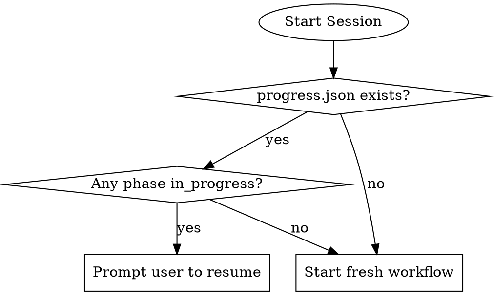
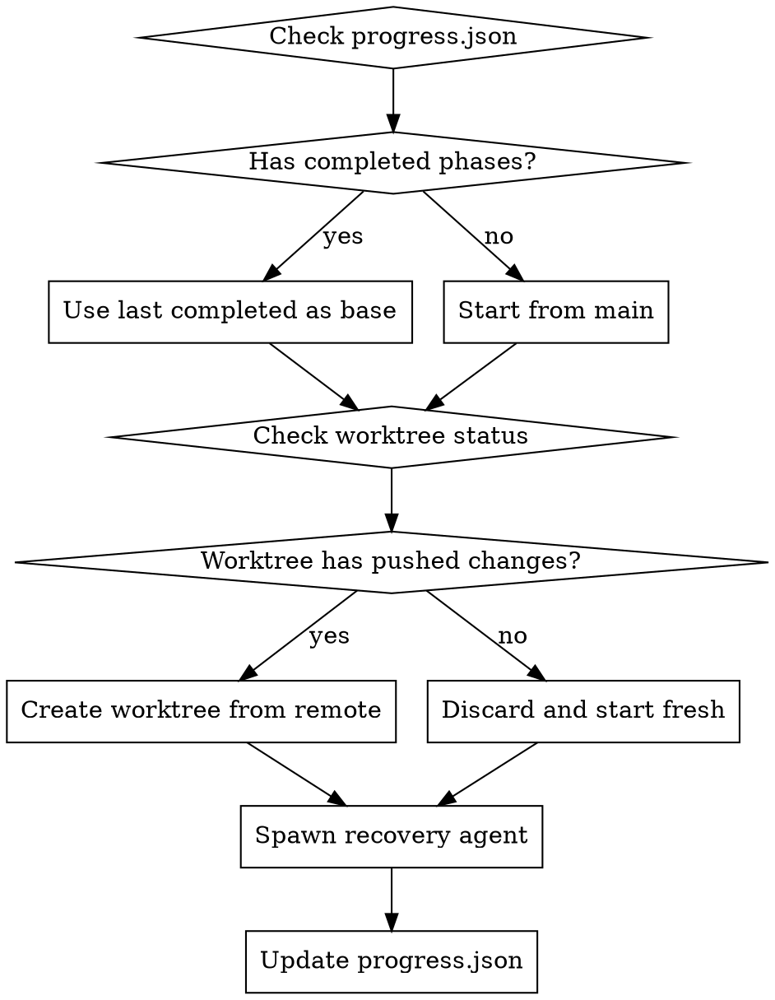

# Recovery Guide

## Overview

This guide describes how to recover from crashes and interruptions during the Rainbow workflow. The main agent tracks progress in `progress.json` to enable recovery.

## Progress Tracking File

### Location

```
.claude/teams/rainbow-workflow/progress.json
```

### Schema

```json
{
  "workflow_id": "string",           // Unique workflow identifier
  "product_name": "string",          // Product name
  "feature_id": "string",            // Current feature ID
  "started_at": "ISO8601 datetime",  // Workflow start time
  "current_phase": "string",         // Current phase name
  "phases": {
    "<phase_name>": {
      "status": "pending|in_progress|completed",
      "agent": "string",             // Agent name responsible
      "started_at": "ISO8601 datetime",
      "completed_at": "ISO8601 datetime|null",
      "outputs": ["string"],         // List of output files
      "branch": "string"             // Git branch used
    }
  },
  "agents_spawned": ["string"],      // List of spawned agent names
  "active_agent": "string|null"      // Currently active agent
}
```

### Example State

```json
{
  "workflow_id": "wf-2024-03-13-001",
  "product_name": "taskify-app",
  "feature_id": "001-user-auth",
  "started_at": "2024-03-13T10:00:00Z",
  "current_phase": "design",
  "phases": {
    "initialize": {
      "status": "completed",
      "agent": "initializer",
      "started_at": "2024-03-13T10:00:00Z",
      "completed_at": "2024-03-13T10:30:00Z",
      "outputs": [
        "memory/ground-rules.md",
        "docs/architecture.md",
        "docs/standards.md"
      ],
      "branch": "rainbow/init/taskify-app"
    },
    "specify": {
      "status": "completed",
      "agent": "specifier",
      "started_at": "2024-03-13T10:30:00Z",
      "completed_at": "2024-03-13T11:00:00Z",
      "outputs": ["specs/001-user-auth/spec.md"],
      "branch": "rainbow/spec/001-user-auth"
    },
    "design": {
      "status": "in_progress",
      "agent": "designer",
      "started_at": "2024-03-13T11:15:00Z",
      "outputs": [],
      "branch": "rainbow/design/001-user-auth"
    }
  },
  "agents_spawned": ["initializer", "specifier", "designer"],
  "active_agent": "designer"
}
```

## Recovery Detection

### When Recovery is Needed

1. **Session crashed**: Agent process terminated unexpectedly
2. **Session interrupted**: User or system stopped the session
3. **Agent timeout**: Agent took too long without response
4. **Manual restart**: User wants to continue previous work

### Detection Method

On session start:
1. Check if `progress.json` exists
2. If exists, check if `current_phase` has `in_progress` status
3. If yes, prompt user to resume or start fresh

## Recovery Procedure

### Step 1: Detect Interrupted Work



### Step 2: Determine Recovery Action

Based on the interrupted phase:

| Phase | Recovery Action |
|-------|-----------------|
| initialize | Restart from scratch (discard incomplete work) |
| assess | Restart assess phase |
| specify | Restart specify phase |
| clarify | Restart clarify (previous spec answers preserved) |
| design | Restart design (discard incomplete designs) |
| taskify | Restart taskify |
| analyze | Restart analyze |
| implement | Check completed tasks, resume from last checkpoint |
| e2e-test | Restart e2e tests |

### Step 3: Recreate Agent Workspace

**IMPORTANT**: Discard incomplete changes and start fresh worktree.

```bash
# 1. Remove old worktree if exists
git worktree remove .claude/worktrees/<agent-name> --force 2>/dev/null || true

# 2. Delete incomplete branch (optional, or create new branch)
git branch -D <branch-name> 2>/dev/null || true

# 3. Fetch latest from remote
git fetch --all

# 4. Create fresh worktree from last known good state
git worktree add -b <branch-name> .claude/worktrees/<agent-name> <start-point>
```

### Step 4: Spawn Recovery Agent

Spawn the agent with recovery context:

```
Agent with:
- name: <agent-name>
- subagent_type: "general-purpose"
- team_name: "rainbow-workflow"
- model: <previously-configured-model>
- isolation: "worktree"
- prompt: |
    You are the <agent-name> agent recovering from an interruption.
    Previous work was interrupted and discarded.
    Start fresh from the current state.

    Context from progress.json:
    - Previous phase: <previous-phase>
    - Previous outputs: <previous-outputs>

    Your task: <phase-specific-task>
```

### Step 5: Update Progress

After spawning recovery agent:

```json
{
  "current_phase": "<phase-name>",
  "phases": {
    "<phase-name>": {
      "status": "in_progress",
      "agent": "<agent-name>",
      "started_at": "<new-timestamp>",
      "outputs": [],
      "branch": "<branch-name>"
    }
  },
  "active_agent": "<agent-name>"
}
```

## Phase-Specific Recovery

### initialize Recovery

```bash
# Discard incomplete initialization
git worktree remove .claude/worktrees/rainbow-initializer --force
git branch -D rainbow/init/<product-name>

# Start fresh
git worktree add -b rainbow/init/<product-name> .claude/worktrees/rainbow-initializer main
```

### specify Recovery

```bash
# Discard incomplete spec
git worktree remove .claude/worktrees/rainbow-specifier --force
git branch -D rainbow/spec/<feature-id>

# Start from initialized state
git fetch origin
git worktree add -b rainbow/spec/<feature-id> .claude/worktrees/rainbow-specifier origin/main
```

### design Recovery

```bash
# Discard incomplete design
git worktree remove .claude/worktrees/rainbow-designer --force
git branch -D rainbow/design/<feature-id>

# Start from spec state
git fetch origin
git worktree add -b rainbow/design/<feature-id> .claude/worktrees/rainbow-designer origin/rainbow/spec/<feature-id>
```

### implement Recovery (Special Case)

Implementation can resume from last completed task:

```bash
# Check which tasks were completed
cd .claude/worktrees/rainbow-implementer
cat specs/<feature-id>/tasks.md | grep "\[X\]"

# Or fetch from remote if pushed
git fetch origin
git log origin/rainbow/impl/<feature-id> --oneline

# Option 1: Resume from existing worktree (if pushed)
git worktree add .claude/worktrees/rainbow-implementer origin/rainbow/impl/<feature-id>

# Option 2: Start fresh (discard incomplete)
git worktree add -b rainbow/impl/<feature-id>-v2 .claude/worktrees/rainbow-implementer origin/rainbow/tasks/<feature-id>
```

## Recovery Decision Tree



## Best Practices for Crash Prevention

### Before Each Phase

1. **Commit and push** current state
2. **Update progress.json** with phase start
3. **Verify worktree** is clean before spawning agent

### After Each Phase

1. **Wait for agent completion**
2. **Verify outputs** exist
3. **Push changes** to remote
4. **Update progress.json** with completion
5. **Remove worktree** if no longer needed

### Periodic Checkpoints

For long-running phases (implement):

1. Agent commits after each task
2. Agent pushes periodically
3. Main agent updates progress.json with checkpoint

## Recovery Checklist

When recovering from a crash:

- [ ] Read `progress.json` to identify interrupted phase
- [ ] Check git remote for any pushed changes
- [ ] Remove stale worktrees: `git worktree prune`
- [ ] Create fresh worktree for recovery agent
- [ ] Spawn agent with recovery context
- [ ] Update `progress.json` with recovery start time
- [ ] Monitor agent progress
- [ ] Update `progress.json` on completion

## Troubleshooting

### progress.json is Corrupted

```bash
# Backup corrupted file
cp .claude/teams/rainbow-workflow/progress.json progress.json.bak

# Check git branches to determine state
git branch -a | grep rainbow/

# Recreate progress.json manually based on git history
```

### No Remote Changes Found

If the crashed agent didn't push:

1. Changes are lost (by design)
2. Start fresh from last known good state
3. Use the last completed phase as base

### Multiple In-Progress Phases

This shouldn't happen with proper sequential workflow. If it does:

1. Check git branches to determine actual state
2. Pick the most recent in-progress phase
3. Mark others as cancelled
4. Resume from chosen phase