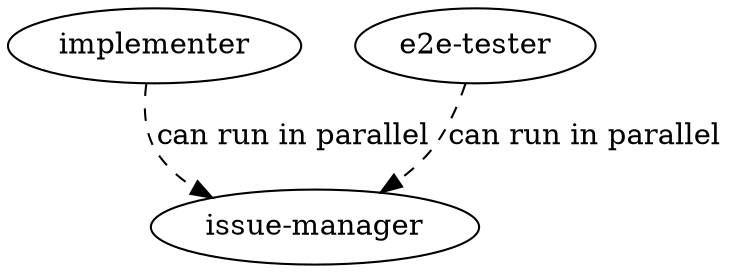
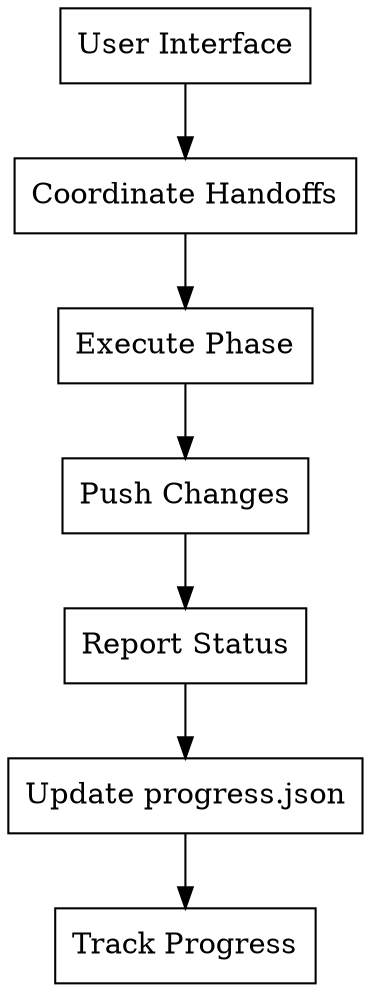
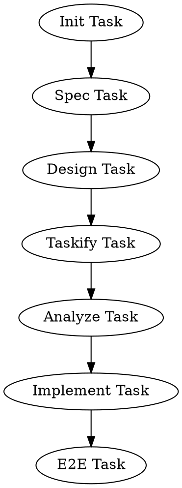

# Team Patterns for Rainbow Workflow

## Table of Contents

1. [Complete Agent Team](#complete-agent-team)
   - [Team Structure](#team-structure)
2. [Agent Details](#agent-details)
   - [initializer Agent](#initializer-agent)
   - [assessor Agent](#assessor-agent)
   - [specifier Agent](#specifier-agent)
   - [clarifier Agent](#clarifier-agent)
   - [designer Agent](#designer-agent)
   - [taskifier Agent](#taskifier-agent)
   - [analyzer Agent](#analyzer-agent)
   - [implementer Agent](#implementer-agent)
   - [e2e-tester Agent](#e2e-tester-agent)
   - [issue-manager Agent](#issue-manager-agent)
3. [Coordination Patterns](#coordination-patterns)
   - [Sequential Handoff](#sequential-handoff-default)
   - [Parallel Execution](#parallel-execution-when-possible)
   - [Communication Flow](#communication-flow)
4. [Task Tracking](#task-tracking)
   - [Creating Tasks for Teammates](#creating-tasks-for-teammates)
   - [Task Dependencies](#task-dependencies)
5. [Team Creation Workflow](#team-creation-workflow)
6. [Error Recovery Patterns](#error-recovery-patterns)
   - [Agent Stuck](#agent-stuck)
   - [Task Failed](#task-failed)
   - [Phase Blocked](#phase-blocked)
   - [Crash Recovery](#crash-recovery)

---

## Complete Agent Team

The Rainbow workflow uses a team of 10 specialized agents with isolated workspaces.

### Team Structure

```json
{
  "team_name": "rainbow-workflow",
  "description": "Spec-Driven Development workflow team with isolated workspaces",
  "members": [
    {"name": "initializer", "role": "One-time setup: regulate, architect, standardize, checklist"},
    {"name": "assessor", "role": "Brownfield analysis: assess-context"},
    {"name": "specifier", "role": "Feature specification: define requirements and user stories"},
    {"name": "clarifier", "role": "Specification clarification: refine underspecified areas"},
    {"name": "designer", "role": "Technical design: implementation plans"},
    {"name": "taskifier", "role": "Task breakdown: generate dependency-ordered tasks"},
    {"name": "analyzer", "role": "Consistency analysis: cross-artifact validation"},
    {"name": "implementer", "role": "Implementation: execute tasks with TDD"},
    {"name": "e2e-tester", "role": "E2E testing: design and execute tests"},
    {"name": "issue-manager", "role": "Issue management: convert tasks to issues"}
  ]
}
```

## Agent Details

### initializer Agent

**Name**: `initializer`

**Commands**: `/rainbow.regulate`, `/rainbow.architect`, `/rainbow.standardize`, `/rainbow.checklist`

**When to Spawn**: Once per product, at the beginning

**Workspace Branch**: `rainbow/init/<product-name>`

**Responsibilities**:
1. Create project principles (`memory/ground-rules.md`)
2. Create system architecture (`docs/architecture.md`)
3. Create coding standards (`docs/standards.md`)
4. Generate quality checklists

**Tools Required**: Read, Write, Bash

**Output Message on Completion**:
```
Initialization complete. Created:
- memory/ground-rules.md
- docs/architecture.md
- docs/standards.md
- checklists/ (if applicable)

Branch pushed: rainbow/init/<product-name>
Ready for specifier or assessor (if brownfield).
```

---

### assessor Agent

**Name**: `assessor`

**Commands**: `/rainbow.assess-context`

**When to Spawn**: Brownfield projects only, after initializer

**Workspace Branch**: `rainbow/assess/<feature-id>`

**Responsibilities**:
1. Analyze existing codebase structure
2. Document current architecture patterns
3. Identify coding conventions
4. Map integration points

**Tools Required**: Read, Grep, Glob, Write

**Output Message on Completion**:
```
Context assessment complete. Updated:
- memory/ground-rules.md (with existing patterns)

Branch pushed: rainbow/assess/<feature-id>
Ready for specifier.
```

---

### specifier Agent

**Name**: `specifier`

**Commands**: `/rainbow.specify`

**When to Spawn**: Every new feature, after init/assess

**Workspace Branch**: `rainbow/spec/<feature-id>`

**Responsibilities**:
1. Parse user's feature description
2. Generate user stories with priorities (P1, P2, P3...)
3. Define functional requirements
4. Create success criteria
5. Identify key entities

**Tools Required**: Read, Write, Bash

**Output Message on Completion**:
```
Specification complete. Created:
- specs/<feature-id>/spec.md
- specs/<feature-id>/checklists/requirements.md

Branch pushed: rainbow/spec/<feature-id>
Ready for clarifier (if needed) or designer.
```

---

### clarifier Agent

**Name**: `clarifier`

**Commands**: `/rainbow.clarify`

**When to Spawn**: When spec has [NEEDS CLARIFICATION] markers

**Workspace Branch**: `rainbow/clarify/<feature-id>`

**Special Communication Pattern**:
```
User ↔ Main Agent ↔ clarifier agent
```

The main agent acts as intermediary:
1. clarifier generates questions → Main agent → User
2. User answers → Main agent → clarifier
3. clarifier updates spec → Main agent confirms

**Responsibilities**:
1. Identify underspecified areas
2. Generate structured clarification questions
3. Process user answers from main agent
4. Update spec.md with clarifications section

**Tools Required**: Read, Write

**Output Message (Questions for User)**:
```
NEEDS CLARIFICATION - Please ask the user:

## Question 1: [Topic]
**Context**: [Quote from spec]
**What we need to know**: [Specific question]
**Options**:
- A: [Option A]
- B: [Option B]
- C: [Option C]

## Question 2: ...
```

**Output Message on Completion**:
```
Clarification complete. Updated:
- specs/<feature-id>/spec.md (added Clarifications section)

All [NEEDS CLARIFICATION] markers resolved.
Branch pushed: rainbow/clarify/<feature-id>
Ready for designer.
```

---

### designer Agent

**Name**: `designer`

**Commands**: `/rainbow.design`

**When to Spawn**: After spec is complete (and clarified if needed)

**Workspace Branch**: `rainbow/design/<feature-id>`

**Responsibilities**:
1. Load spec and context
2. Research technical unknowns
3. Generate data models
4. Create API contracts
5. Write implementation plan

**Tools Required**: Read, Write, WebSearch, Bash

**Output Message on Completion**:
```
Design complete. Created:
- specs/<feature-id>/design.md
- specs/<feature-id>/research.md
- specs/<feature-id>/data-model.md
- specs/<feature-id>/contracts/
- specs/<feature-id>/quickstart.md

Branch pushed: rainbow/design/<feature-id>
Ready for taskifier.
```

---

### taskifier Agent

**Name**: `taskifier`

**Commands**: `/rainbow.taskify`

**When to Spawn**: After design complete

**Workspace Branch**: `rainbow/tasks/<feature-id>`

**Responsibilities**:
1. Load design documents
2. Extract user stories from spec
3. Map entities to stories
4. Generate dependency-ordered tasks
5. Create parallel execution markers

**Tools Required**: Read, Write

**Output Message on Completion**:
```
Task breakdown complete. Created:
- specs/<feature-id>/tasks.md

Summary:
- Total tasks: <N>
- User Story 1 (P1): <N> tasks
- User Story 2 (P2): <N> tasks
- Parallel opportunities: <N> tasks marked [P]

Branch pushed: rainbow/tasks/<feature-id>
Ready for analyzer.
```

---

### analyzer Agent

**Name**: `analyzer`

**Commands**: `/rainbow.analyze`

**When to Spawn**: After tasks generated, before implementation

**Workspace Branch**: `rainbow/analyze/<feature-id>`

**Responsibilities**:
1. Cross-artifact consistency check
2. Coverage analysis
3. Identify gaps and conflicts
4. Validate task completeness

**Tools Required**: Read, Write

**Output Message on Completion**:
```
Analysis complete. Results:
- Spec coverage: <X>%
- Design-spec alignment: PASS/FAIL
- Task coverage: <X>%
- Issues found: <N>

Issues (if any):
1. [Issue description]
2. ...

Recommendations:
- [Recommendation 1]
- [Recommendation 2]

Branch pushed: rainbow/analyze/<feature-id>
Ready for implementer.
```

---

### implementer Agent

**Name**: `implementer`

**Commands**: `/rainbow.implement`

**When to Spawn**: After analysis (if passed) or user confirms to proceed

**Workspace Branch**: `rainbow/impl/<feature-id>`

**Responsibilities**:
1. Load tasks and design
2. Execute phase by phase
3. Follow TDD: Tests before code
4. Mark completed tasks in tasks.md
5. Commit after each logical unit

**Tools Required**: Read, Write, Edit, Bash

**Output Message (Progress)**:
```
Implementation progress:
- Phase 1 (Setup): Complete (5/5 tasks)
- Phase 2 (US1): In Progress (3/8 tasks)
- Current task: T012 - Create UserService

Last commit: feat: implement user authentication
```

**Output Message on Completion**:
```
Implementation complete. Results:
- Total tasks: <N>
- Completed: <N>
- Tests passing: Yes/No
- Coverage: <X>%

Commits made: <N>
Branch pushed: rainbow/impl/<feature-id>
Ready for e2e-tester.
```

---

### e2e-tester Agent

**Name**: `e2e-tester`

**Commands**: `/rainbow.design-e2e-test`, `/rainbow.perform-e2e-test`

**When to Spawn**: After implementation complete

**Workspace Branch**: `rainbow/e2e/<feature-id>`

**Responsibilities**:
1. Design E2E test specifications
2. Create test scripts
3. Execute E2E tests
4. Generate test reports

**Tools Required**: Read, Write, Bash

**Output Message on Completion**:
```
E2E testing complete. Results:
- Test scenarios: <N>
- Passed: <N>
- Failed: <N>
- Skipped: <N>

Created:
- tests/e2e/<feature-id>/specs.md
- tests/e2e/<feature-id>/scripts/
- tests/e2e/<feature-id>/report.md

Branch pushed: rainbow/e2e/<feature-id>
Feature ready for deployment.
```

---

### issue-manager Agent

**Name**: `issue-manager`

**Commands**: `/rainbow.tasks-to-issues`, `/rainbow.tasks-to-ado`

**When to Spawn**: Optional, when GitHub/Azure DevOps tracking needed

**Workspace Branch**: `rainbow/issues/<feature-id>`

**Responsibilities**:
1. Parse tasks from tasks.md
2. Create GitHub issues or Azure DevOps work items
3. Set dependencies between issues
4. Link issues to tasks

**Tools Required**: Read, Bash (gh/ado CLI)

**Output Message on Completion**:
```
Issue conversion complete. Created:
- GitHub issues: <N>
- Dependencies set: <N>

Issue links:
- #101: T001 - Setup project structure
- #102: T002 - Create database schema (depends on #101)
- ...

Branch pushed: rainbow/issues/<feature-id>
```

## Coordination Patterns

### Sequential Handoff (Default)

Most phases must run sequentially:

```dot
digraph sequential {
    rankdir=LR;

    "initializer" -> "specifier" [label="init complete"];
    "specifier" -> "clarifier" [label="needs clarification"];
    "clarifier" -> "designer";
    "designer" -> "taskifier";
    "taskifier" -> "analyzer";
    "analyzer" -> "implementer";
    "implementer" -> "e2e-tester";
}
```



### Parallel Execution (When Possible)

Some agents can run in parallel:



### Communication Flow



## Task Tracking

### Creating Tasks for Teammates

When the main agent creates tasks for phases:

```json
// Example: Design task
{
  "subject": "Execute design phase for feature",
  "description": "Run /rainbow.design to create technical implementation plan. Load spec.md and generate design.md, research.md, data-model.md, and contracts/",
  "owner": "designer",
  "status": "pending",
  "metadata": {
    "branch": "rainbow/design/001-user-auth",
    "start_point": "origin/rainbow/clarify/001-user-auth"
  }
}
```

### Task Dependencies



## Team Creation Workflow

### Step 0: Confirm Model Selection

Use AskUserQuestion for model confirmation per agent.

### Step 1: Create Team

```
TeamCreate with:
- team_name: "rainbow-workflow"
- description: "Spec-Driven Development workflow team"
```

### Step 2: Create Progress Tracking

Create `.claude/teams/rainbow-workflow/progress.json`:

```json
{
  "workflow_id": "wf-<timestamp>",
  "current_phase": "initialize",
  "phases": {},
  "agents_spawned": [],
  "active_agent": null
}
```

### Step 3: Spawn First Agent (initializer)

1. Create worktree:
   ```bash
   git worktree add -b rainbow/init/<product-name> .claude/worktrees/rainbow-initializer
   ```

2. Spawn agent:
   ```
   Agent with:
   - name: "initializer"
   - subagent_type: "general-purpose"
   - team_name: "rainbow-workflow"
   - model: <confirmed-model>
   - isolation: "worktree"
   ```

3. Update progress.json

### Step 4: Monitor and Handoff

1. Wait for agent completion message
2. Agent pushes changes to remote
3. Update progress.json
4. Spawn next agent with new worktree

### Step 5: Continue Through Phases

Repeat for each phase until complete.

### Step 6: Cleanup

1. Send shutdown_request to all agents
2. Merge final changes
3. Remove worktrees
4. TeamDelete

## Error Recovery Patterns

### Agent Stuck

1. Send clarification message
2. If still stuck after timeout, send shutdown_request
3. Check worktree status
4. Spawn fresh agent if needed

### Task Failed

1. Review error in agent message
2. Determine if fixable by same agent
3. If fixable: Send fix instructions
4. If not: Spawn new agent with corrected context

### Phase Blocked

1. Identify blocker from agent message
2. Create task to resolve blocker
3. Spawn appropriate agent
4. Resume blocked phase after resolution

### Crash Recovery

See [recovery-guide.md](recovery-guide.md) for full crash recovery procedures.