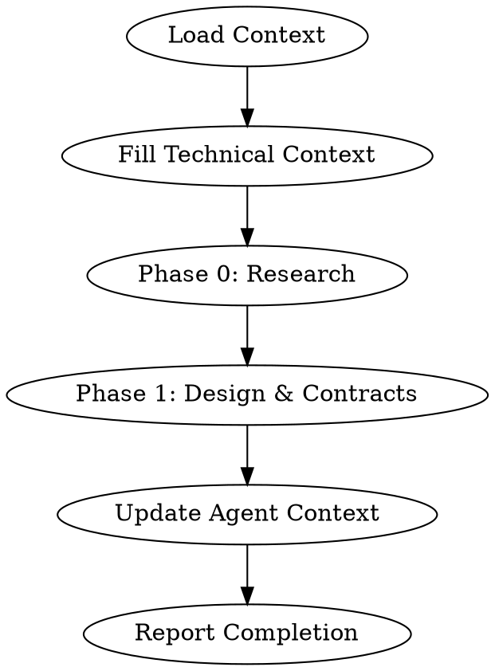

# Rainbow Workflow Details

## Complete Phase Specifications

### Phase 0: Setup (Before Rainbow Workflow)

Before starting the Rainbow workflow, ensure:

1. **Project initialized**: `rainbow init <project_name>`
2. **AI agent configured**: Claude Code, Gemini CLI, or other supported agent
3. **Git repository**: Initialized with proper `.gitignore`

### Phase 1: Regulate (Greenfield) / Assess Context (Brownfield)

#### Greenfield: `/rainbow.regulate`

**Purpose**: Establish project governing principles

**Output**: `memory/ground-rules.md`

**Content**:
- Code quality standards
- Testing requirements
- User experience guidelines
- Performance requirements
- Governance for technical decisions

#### Brownfield: `/rainbow.assess-context`

**Purpose**: Analyze existing codebase patterns

**Output**: `memory/ground-rules.md`, context documentation

**Analysis includes**:
- Existing architecture patterns
- Code conventions
- Technology stack
- Integration points

### Phase 2: Specify

**Command**: `/rainbow.specify`

**Purpose**: Define WHAT to build and WHY

**Input**: Natural language feature description

**Output**: `specs/<feature-number>-<feature-name>/spec.md`

**Spec Structure**:
```markdown
# Feature Specification

## Overview
## User Stories (with priorities P1, P2, P3...)
## Functional Requirements
## Non-Functional Requirements
## Success Criteria
## Key Entities
## Assumptions
```

**Important Rules**:
- Focus on WHAT and WHY, not HOW
- No implementation details (languages, frameworks, APIs)
- Written for business stakeholders
- Maximum 3 [NEEDS CLARIFICATION] markers

### Phase 3: Clarify (Optional but Recommended)

**Command**: `/rainbow.clarify`

**Purpose**: Refine specification before planning

**When to use**:
- Before `/rainbow.design`
- When spec has [NEEDS CLARIFICATION] markers
- For complex features requiring deeper analysis

### Phase 4: Architect (Product-Level, Run Once)

**Command**: `/rainbow.architect`

**Purpose**: Create system architecture documentation

**Output**: `docs/architecture.md`

**Content**:
- C4 diagrams (Context, Container, Component)
- Technology stack decisions
- Architecture patterns
- Quality strategies
- ADRs (Architecture Decision Records)

### Phase 5: Standardize (Product-Level, Run Once)

**Command**: `/rainbow.standardize`

**Purpose**: Create coding standards

**Output**: `docs/standards.md`

**Content**:
- Naming conventions (UI, code, database)
- File organization
- API design standards
- Testing standards
- Git commit conventions

### Phase 6: Design

**Command**: `/rainbow.design`

**Purpose**: Create technical implementation plan

**Prerequisites**: `spec.md` complete

**Output Files**:
- `design.md` - Tech stack, architecture, file structure
- `research.md` - Technical decisions and rationale
- `data-model.md` - Entities and relationships
- `contracts/` - API specifications (OpenAPI/GraphQL)
- `quickstart.md` - Integration scenarios

**Execution Flow**:



### Phase 7: Taskify

**Command**: `/rainbow.taskify`

**Purpose**: Generate actionable task list

**Prerequisites**: Design artifacts complete

**Output**: `tasks.md`

**Task Organization**:
1. Phase 1: Setup
2. Phase 2: Foundational (blocking prerequisites)
3. Phase 3+: User Stories in priority order (P1, P2, P3...)
4. Final Phase: Polish & Cross-Cutting

**Task Format (REQUIRED)**:
```markdown
- [ ] [TaskID] [P?] [Story?] Description with file path
```

### Phase 8: Implement

**Command**: `/rainbow.implement`

**Purpose**: Execute tasks to build the feature

**Prerequisites**: `tasks.md` generated

**Execution Rules**:
1. Phase-by-phase execution
2. Sequential tasks in order, parallel tasks [P] together
3. TDD approach: Tests before code
4. File-based coordination: Same files = sequential
5. Validation checkpoints between phases

**Progress Tracking**:
- Mark completed tasks: `- [X]`
- Commit after each logical unit
- Report progress after each task

## Quality Gates

Each phase has quality gates that must pass:

| Phase | Quality Gate |
|-------|-------------|
| Specify | No [NEEDS CLARIFICATION] markers, testable requirements |
| Design | All NEEDS CLARIFICATION resolved, contracts valid |
| Taskify | All user stories have tasks, dependencies mapped |
| Implement | All tasks complete, tests pass, spec matched |

## Error Handling

### Common Errors and Solutions

1. **"Cannot determine user scenarios"**
   - Solution: Provide more detailed feature description
   - Use `/rainbow.clarify` to refine

2. **"Gate failures or unresolved clarifications"**
   - Solution: Address each NEEDS CLARIFICATION
   - Research unknown technical decisions

3. **"Tasks are incomplete or missing"**
   - Solution: Run `/rainbow.taskify` to regenerate

4. **"Checklists incomplete"**
   - Solution: Complete checklist items before implementation
   - Or explicitly confirm to proceed anyway