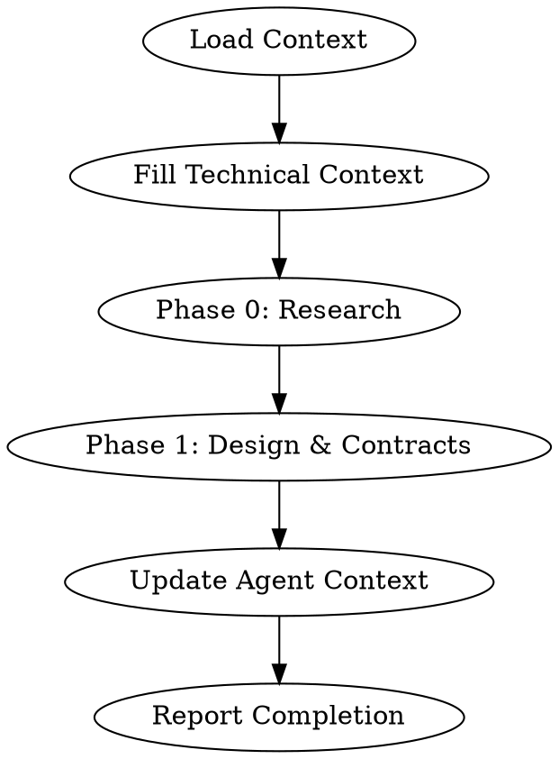

# Rainbow Workflow Details

## Table of Contents

1. [Setup Prerequisites](#setup-prerequisites)
2. [Phase Details](#phase-details)
   - [Phase 1: Initialize](#phase-1-initialize-initializer-agent)
   - [Phase 2: Assess Context](#phase-2-assess-context-assessor-agent---brownfield-only)
   - [Phase 3: Specify](#phase-3-specify-specifier-agent)
   - [Phase 4: Clarify](#phase-4-clarify-clarifier-agent)
   - [Phase 5: Design](#phase-5-design-designer-agent)
   - [Phase 6: Taskify](#phase-6-taskify-taskifier-agent)
   - [Phase 7: Analyze](#phase-7-analyze-analyzer-agent)
   - [Phase 8: Implement](#phase-8-implement-implementer-agent)
   - [Phase 9: E2E Test](#phase-9-e2e-test-e2e-tester-agent)
   - [Optional: Issue Management](#optional-issue-management-issue-manager-agent)
3. [Quality Gates](#quality-gates)
4. [Error Handling](#error-handling)

---

## Setup Prerequisites

Before starting the Rainbow workflow, ensure:

1. **Project initialized**: `rainbow init <project_name>`
2. **AI agent configured**: Claude Code, Gemini CLI, or other supported agent
3. **Git repository**: Initialized with proper `.gitignore`

---

## Phase Details

### Phase 1: Initialize (initializer agent)

**Trigger**: Product initialization

**Commands**: `/rainbow.regulate`, `/rainbow.architect`, `/rainbow.standardize`, `/rainbow.checklist`

**Actions**:
1. Create project principles (`memory/ground-rules.md`)
2. Create system architecture (`docs/architecture.md`)
3. Create coding standards (`docs/standards.md`)
4. Generate quality checklists

**Output**: Foundation documents for the product

**Branch**: `rainbow/init/<product-name>`

---

### Phase 2: Assess Context (assessor agent) - Brownfield Only

**Trigger**: Existing codebase analysis

**Commands**: `/rainbow.assess-context`

**Actions**:
1. Analyze existing architecture patterns
2. Document current conventions
3. Identify integration points

**Output**: `memory/ground-rules.md` (updated for existing codebase)

**Branch**: `rainbow/assess/<feature-id>`

---

### Phase 3: Specify (specifier agent)

**Trigger**: New feature development

**Commands**: `/rainbow.specify`

**Actions**:
1. Parse user's feature description
2. Generate user stories with priorities
3. Define functional requirements
4. Create success criteria

**Output**: `specs/<feature-id>/spec.md`

**Branch**: `rainbow/spec/<feature-id>`

**Spec Structure**:
```markdown
# Feature Specification

## Overview
## User Stories (with priorities P1, P2, P3...)
## Functional Requirements
## Non-Functional Requirements
## Success Criteria
## Key Entities
## Assumptions
```

**Important Rules**:
- Focus on WHAT and WHY, not HOW
- No implementation details (languages, frameworks, APIs)
- Written for business stakeholders
- Maximum 3 [NEEDS CLARIFICATION] markers

---

### Phase 4: Clarify (clarifier agent)

**Trigger**: Specification needs refinement

**Commands**: `/rainbow.clarify`

**Communication Pattern**:
```
User → Main Agent → clarifier agent (questions)
clarifier agent → Main Agent → User (present questions)
User → Main Agent → clarifier agent (answers)
```

**Actions**:
1. Identify underspecified areas
2. Generate clarification questions
3. Update spec based on answers

**Output**: Updated `spec.md` with clarifications section

**Branch**: `rainbow/clarify/<feature-id>`

---

### Phase 5: Design (designer agent)

**Trigger**: Specification complete

**Commands**: `/rainbow.design`

**Actions**:
1. Load spec and context
2. Research technical unknowns
3. Design data models
4. Create API contracts
5. Generate implementation plan

**Output**: `design.md`, `research.md`, `data-model.md`, `contracts/`, `quickstart.md`

**Branch**: `rainbow/design/<feature-id>`

**Execution Flow**:



---

### Phase 6: Taskify (taskifier agent)

**Trigger**: Design artifacts complete

**Commands**: `/rainbow.taskify`

**Actions**:
1. Extract user stories from spec
2. Map entities to stories
3. Generate dependency-ordered tasks
4. Create parallel execution markers

**Output**: `tasks.md`

**Branch**: `rainbow/tasks/<feature-id>`

**Task Organization**:
1. Phase 1: Setup
2. Phase 2: Foundational (blocking prerequisites)
3. Phase 3+: User Stories in priority order (P1, P2, P3...)
4. Final Phase: Polish & Cross-Cutting

**Task Format (REQUIRED)**:
```markdown
- [ ] [TaskID] [P?] [Story?] Description with file path
```

---

### Phase 7: Analyze (analyzer agent)

**Trigger**: Tasks generated, before implementation

**Commands**: `/rainbow.analyze`

**Actions**:
1. Cross-artifact consistency check
2. Coverage analysis
3. Identify gaps and conflicts

**Output**: Analysis report, updated tasks if needed

**Branch**: `rainbow/analyze/<feature-id>`

---

### Phase 8: Implement (implementer agent)

**Trigger**: Analysis complete

**Commands**: `/rainbow.implement`

**Actions**:
1. Load tasks and design
2. Execute phase by phase
3. Follow TDD approach
4. Mark completed tasks
5. Commit after each unit

**Output**: Working implementation

**Branch**: `rainbow/impl/<feature-id>`

**Execution Rules**:
1. Phase-by-phase execution
2. Sequential tasks in order, parallel tasks [P] together
3. TDD approach: Tests before code
4. File-based coordination: Same files = sequential
5. Validation checkpoints between phases

**Progress Tracking**:
- Mark completed tasks: `- [X]`
- Commit after each logical unit
- Report progress after each task

---

### Phase 9: E2E Test (e2e-tester agent)

**Trigger**: Implementation complete

**Commands**: `/rainbow.design-e2e-test`, `/rainbow.perform-e2e-test`

**Actions**:
1. Design E2E test specifications
2. Execute E2E tests
3. Generate test reports

**Output**: E2E test suite and reports

**Branch**: `rainbow/e2e/<feature-id>`

---

### Optional: Issue Management (issue-manager agent)

**Trigger**: When GitHub/Azure DevOps tracking needed

**Commands**: `/rainbow.tasks-to-issues`, `/rainbow.tasks-to-ado`

**Actions**:
1. Parse tasks from tasks.md
2. Create issues/work items
3. Set dependencies

**Output**: GitHub issues or Azure DevOps work items

**Branch**: `rainbow/issues/<feature-id>`

---

## Quality Gates

Each phase has quality gates that must pass:

| Phase | Quality Gate |
|-------|-------------|
| Specify | No [NEEDS CLARIFICATION] markers, testable requirements |
| Clarify | All clarification questions answered |
| Design | All NEEDS CLARIFICATION resolved, contracts valid |
| Taskify | All user stories have tasks, dependencies mapped |
| Analyze | No critical issues found |
| Implement | All tasks complete, tests pass, spec matched |

---

## Error Handling

### Common Errors and Solutions

1. **"Cannot determine user scenarios"**
   - Solution: Provide more detailed feature description
   - Use `/rainbow.clarify` to refine

2. **"Gate failures or unresolved clarifications"**
   - Solution: Address each NEEDS CLARIFICATION
   - Research unknown technical decisions

3. **"Tasks are incomplete or missing"**
   - Solution: Run `/rainbow.taskify` to regenerate

4. **"Checklists incomplete"**
   - Solution: Complete checklist items before implementation
   - Or explicitly confirm to proceed anyway

5. **"Analysis found critical issues"**
   - Solution: Fix issues in design/tasks before implementation
   - Re-run `/rainbow.analyze` after fixes