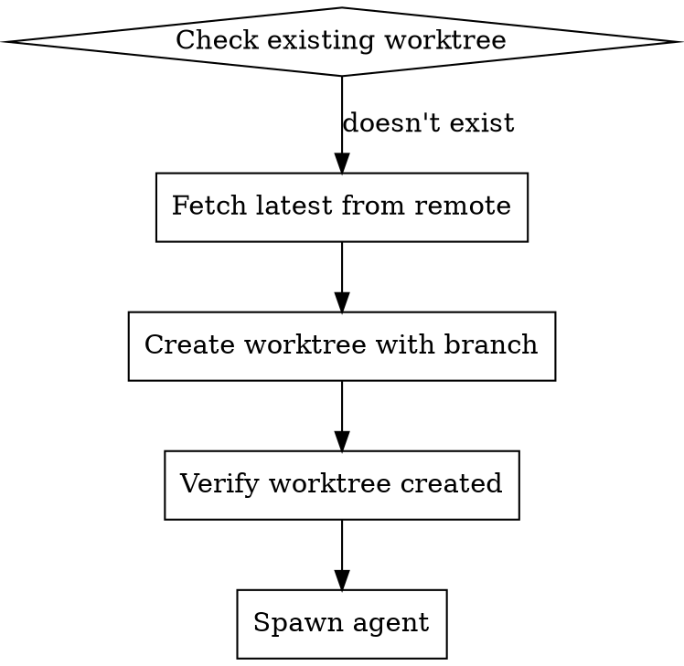

# Workspace Setup Guide

## Git Worktree Architecture

Each agent works in an isolated git worktree to prevent conflicts and enable parallel work.

### Worktree Directory Structure

```
<project-root>/
├── .claude/
│   ├── worktrees/
│   │   ├── rainbow-initializer/
│   │   ├── rainbow-assessor/
│   │   ├── rainbow-specifier/
│   │   ├── rainbow-clarifier/
│   │   ├── rainbow-designer/
│   │   ├── rainbow-taskifier/
│   │   ├── rainbow-analyzer/
│   │   ├── rainbow-implementer/
│   │   ├── rainbow-e2e-tester/
│   │   └── rainbow-issue-manager/
│   └── teams/
│       └── rainbow-workflow/
│           ├── config.json
│           └── progress.json
└── .rainbow/
    └── ...
```

## Creating a Worktree

### Command Format

```bash
git worktree add -b <branch-name> <worktree-path> [<start-point>]
```

### Creating Worktree for Each Agent

#### initializer

```bash
# Create worktree with new branch
git worktree add -b rainbow/init/<product-name> .claude/worktrees/rainbow-initializer

# Or from specific commit
git worktree add -b rainbow/init/<product-name> .claude/worktrees/rainbow-initializer HEAD
```

#### specifier

```bash
# Create worktree from main
git worktree add -b rainbow/spec/<feature-id> .claude/worktrees/rainbow-specifier main

# Or from existing feature branch
git worktree add -b rainbow/spec/<feature-id> .claude/worktrees/rainbow-specifier origin/main
```

#### designer

```bash
# Create worktree from specifier's completed work
git fetch origin
git worktree add -b rainbow/design/<feature-id> .claude/worktrees/rainbow-designer origin/rainbow/spec/<feature-id>
```

#### implementer

```bash
# Create worktree from taskifier's completed work
git fetch origin
git worktree add -b rainbow/impl/<feature-id> .claude/worktrees/rainbow-implementer origin/rainbow/tasks/<feature-id>
```

## Worktree Lifecycle

### Creation Flow



### Cleanup Flow

```bash
# After agent completes work and pushes to remote

# 1. Verify changes are pushed
git -C .claude/worktrees/<agent-name> status

# 2. Remove worktree
git worktree remove .claude/worktrees/<agent-name>

# 3. Optional: delete branch if merged
git branch -d <branch-name>

# 4. Prune stale worktrees
git worktree prune
```

## Synchronization Between Agents

### Push Changes (Agent Completes Work)

```bash
# Inside agent's worktree
cd .claude/worktrees/<agent-name>

# Stage and commit changes
git add .
git commit -m "<commit-message>"

# Push to remote
git push -u origin <branch-name>
```

### Pull Changes (Next Agent Starts)

```bash
# In main workspace, fetch all changes
git fetch --all

# Create new worktree from previous agent's branch
git worktree add -b <new-branch> .claude/worktrees/<new-agent> origin/<previous-branch>
```

### Synchronization Diagram

```dot
digraph sync {
    rankdir=LR;
    node [shape=box];

    subgraph "Agent A Worktree" {
        "A: Make changes" -> "A: Commit";
        "A: Commit" -> "A: Push to origin";
    }

    "Git Remote" [shape=cylinder];

    subgraph "Agent B Worktree" {
        "B: Fetch from origin" -> "B: Create worktree";
        "B: Create worktree" -> "B: Continue work";
    }

    "A: Push to origin" -> "Git Remote";
    "Git Remote" -> "B: Fetch from origin";
}
```



## Branch Management

### Branch Naming Convention

| Pattern | Example | Purpose |
|---------|---------|---------|
| `rainbow/init/<product>` | `rainbow/init/taskify-app` | Product initialization |
| `rainbow/assess/<feature>` | `rainbow/assess/001-user-auth` | Context assessment |
| `rainbow/spec/<feature>` | `rainbow/spec/001-user-auth` | Feature specification |
| `rainbow/clarify/<feature>` | `rainbow/clarify/001-user-auth` | Spec clarification |
| `rainbow/design/<feature>` | `rainbow/design/001-user-auth` | Technical design |
| `rainbow/tasks/<feature>` | `rainbow/tasks/001-user-auth` | Task breakdown |
| `rainbow/analyze/<feature>` | `rainbow/analyze/001-user-auth` | Analysis |
| `rainbow/impl/<feature>` | `rainbow/impl/001-user-auth` | Implementation |
| `rainbow/e2e/<feature>` | `rainbow/e2e/001-user-auth` | E2E testing |
| `rainbow/issues/<feature>` | `rainbow/issues/001-user-auth` | Issue management |

### Branch Merging Strategy

When a phase is complete, merge to main:

```bash
# From main workspace
git checkout main
git merge rainbow/<phase>/<feature-id> --no-ff -m "Merge rainbow/<phase>/<feature-id>"

# Push to remote
git push origin main

# Delete feature branch (optional)
git branch -d rainbow/<phase>/<feature-id>
git push origin --delete rainbow/<phase>/<feature-id>
```

## Handling Conflicts

### When Conflicts Occur

If two agents somehow modify the same file:

1. **Identify conflict**:
   ```bash
   git status
   ```

2. **Resolve in the appropriate worktree**:
   ```bash
   cd .claude/worktrees/<agent-name>
   git merge origin/main
   # Resolve conflicts
   git add .
   git commit
   git push
   ```

3. **Prevention is better**: Always use sequential phases with proper handoffs

### Conflict Prevention Rules

1. Each agent only modifies files in its designated scope
2. Agents pull latest before starting work
3. Main agent coordinates handoffs properly
4. Never spawn two agents that might modify the same files

## Worktree Best Practices

### DO

- Create worktree before spawning agent
- Use descriptive branch names following convention
- Push changes before completing agent task
- Remove worktree after agent is done
- Prune stale worktrees periodically

### DON'T

- Don't share worktrees between agents
- Don't modify files outside worktree scope
- Don't leave uncommitted changes when agent completes
- Don't forget to push before handoff
- Don't spawn multiple agents for same phase

## Troubleshooting

### Worktree Already Exists

```bash
# Check if worktree exists
git worktree list

# Remove if stale
git worktree remove .claude/worktrees/<agent-name> --force

# Prune deleted worktrees
git worktree prune
```

### Branch Already Exists

```bash
# Check if branch exists
git branch -a | grep rainbow/

# Delete if needed
git branch -D rainbow/<phase>/<feature-id>

# Or use different branch name
git worktree add -b rainbow/<phase>/<feature-id>-v2 .claude/worktrees/<agent-name>
```

### Detached HEAD in Worktree

```bash
# Create new branch from detached HEAD
cd .claude/worktrees/<agent-name>
git checkout -b rainbow/<phase>/<feature-id>
```

### Remote Not Found

```bash
# Check remote
git remote -v

# Add remote if missing
git remote add origin <repository-url>

# Fetch
git fetch origin
```